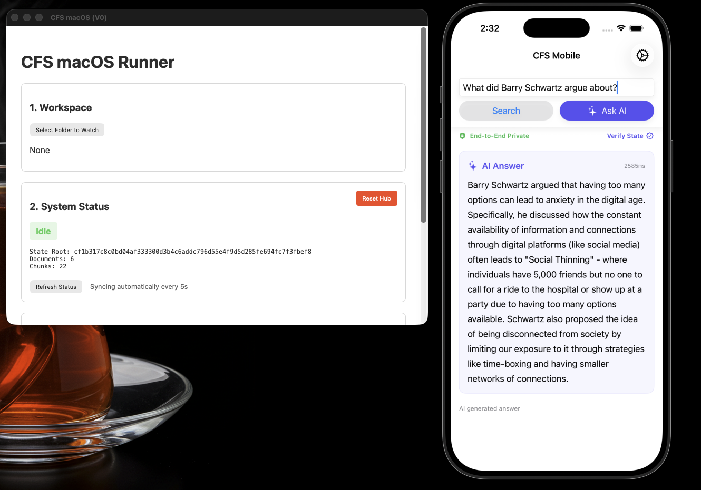

# Cognitive Filesystem (CFS)

Cognitive Filesystem (CFS) is a **local-first, deterministic semantic storage and retrieval system** written in rust, designed to index personal documents, keep them continuously up to date, and make them searchable across devices with cryptographic verification.

It is a **semantic substrate** intended to be stable, inspectable, and correct before any LLM-based intelligence is layered on top.

CFS currently provides a complete end-to-end pipeline for:

* Local document ingestion
* Incremental semantic indexing
* Hybrid (lexical + vector) retrieval
* Deterministic context assembly
* Encrypted, verifiable synchronization
* 100% Local AI (LLM) Inference on iOS
* Desktop and mobile parity

No cloud inference or external AI APIs are required.

---

## Core Principles

* **Local-first**
  All ingestion, indexing, and retrieval run locally.

* **Deterministic**
  Identical inputs produce identical state roots, chunk IDs, and retrieval results.

* **Mutable but stable**
  File changes trigger incremental updates without reindexing unrelated content.

* **Inspectable**
  Internal state (chunks, hashes, state roots) is visible and debuggable.

---

## What CFS Does Today

### Document Ingestion

* Watches local directories for changes
* Supports Markdown, text, and PDF
* Canonicalizes content to eliminate nondeterminism
* Splits documents into stable, section-aware chunks
* Computes hierarchical Merkle hashes (chunk → section → document)

### Indexing

* Vector index (HNSW) for semantic search
* SQLite FTS5 index for lexical search
* Explicit embedding versioning
* Incremental re-embedding only for changed chunks

### Retrieval

* **Hybrid search** combining:

  * Semantic (vector) results
  * Lexical (keyword) results
* Fusion via Reciprocal Rank Fusion (RRF)
* Chunk-ID–based deduplication
* Deterministic ordering
* No rerankers or LLM involvement

### Context Assembly

* Deterministic packing of chunks
* Token-budget enforcement
* Stable ordering by score, document, and offset
* Byte-identical output for identical queries

### Sync

* Encrypted, authenticated diff-based sync
* Merkle-root state verification
* Idempotent diff application
* Desktop as writer, mobile as reader (V0)
* No server-side knowledge of content

---

## Applications

### macOS App

* Folder selection and live ingestion
* State root and graph statistics display
* Hybrid query interface
* Chunk browser (debug surface)
* Manual sync controls

### iOS App

* Read-only local graph (V0)
* Encrypted state pull with Merkle-root verification
* Hybrid query support (Semantic + Lexical)
* **Local AI Integration**: On-device LLM inference via `llama.cpp`
* **Trust & Transparency**: 
    * "End-to-End Private" badge confirms local work
    * State Verification view explains deterministic state roots
    * Verified latency metrics for every generation

Both apps are intentionally minimal and expose internal state rather than hiding it.

---

## Repository Structure

### Core Crates (`/crates`)
* `cfs-core` — Canonical data models, hashing, cryptographic primitives
* `cfs-parser` — Document parsing and chunking (PDF, Markdown, Text)
* `cfs-embeddings` — Local embedding generation (CPU-only)
* `cfs-graph` — SQLite + HNSW hybrid storage engine
* `cfs-query` — Hybrid retrieval, RRF fusion, and context assembly
* `cfs-inference-mobile` — Local LLM inference engine (`llama.cpp` + GGUF)
* `cfs-sync` — Merkle tree diffing, encryption, and state convergence
* `cfs-relay-client` — HTTP client for encrypted blob synchronization
* `cfs-desktop` — Desktop-specific ingestion and watcher logic
* `cfs-mobile` — C FFI for iOS/Android integration
* `cfs-desktop-cli` — Command-line interface for graph inspection
* `cfs-tests` — End-to-end and cross-platform validation tests

### Applications (`/apps`)
* `apps/macos` — macOS Tauri UI wrapper
* `apps/ios` — iOS SwiftUI application

### Relay Server (`/relay`)
* `relay/cfs-relay-server` — Blind Axum-based encrypted blob storage

### Infrastructure & Tools
* `scripts/` — Build and deployment scripts (e.g., iOS cross-compilation)
* `test_corpus/` — Curated dataset for system validation and RAG testing

---

## Philosophy

CFS is built bottom-up.
Intelligence comes **after** correctness.

